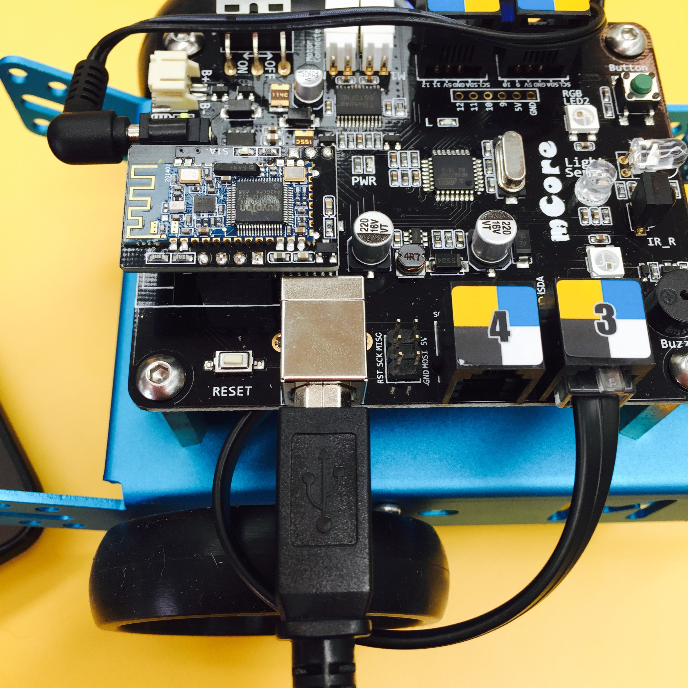
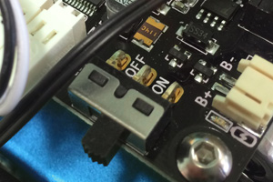
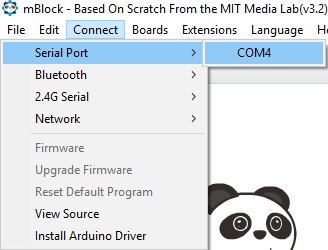
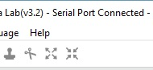

---
layout: default
title: Introduction
course: workshop

slides:

  - class: title-slide

    content: |

      

      # Robotics with mBot
      

    notes: |

      Welcome to Programming with Robots!

      This workshop is designed to introduce you to the basics of programming robots to do cool things.

##########

  - content: |

      ## Course Overview

      **Basic Motion**

      _Morning Break_

      **Sensors**

      _Lunch Break_

      **Self-driving Robots**

    notes: |

      Today's workshop is arranged in six different sections.

      In the first part we will look at basic motion and features, and also try out some programs and do a few challenges. 

      After that we will move on to more difficult stuff like sensors and control statements you can use.

      Later we will program with remote controls and use ultrasonic sensors, yay!
    

##########

  - content: |

      {: height="200"}

      ## Installing mBlock

      The mBlock app will allow us to program our mBot.

      Download for [Windows](assets/zip/mBlock_win_v3.2.2.zip){: target="_blank"} or [Mac](assets/zip/mBlock_mac_v3.2.2.zip){: target="_blank"} and install.

      The mBlock app should now be installed.
      {:.checkpoint}

    notes: |

      :)

    

##########

  - content: |

      {: height="200"}

      ## Installing mBot Drivers

      The mBot drivers allow our computer 
      to communicate with the mBot robot over USB.

      Download for [Windows](assets/zip/mBot_drivers_win.zip){: target="_blank"} or [Mac](assets/zip/mBot_drivers_mac.zip){: target="_blank"} and install.

      The drivers should now be installed.
      {: .checkpoint }

##########

  - content: |

      ## Connect mBot

      - {: height="200" width="300"}
        Plug in USB cable
      - {: height="200" width="300"}
        Turn robot on
      - {: height="200" width="300"}
        Connect robot to mBlock
      {: .flex-list}

      Note that if there are no serial ports available, 
      your drivers may not be installed correctly.

      The mBot's COM port should be selected.
      {:.checkpoint}
    
    notes: |

      :)

    

##########

  - content: |

      ## Are you connected?
      {: height="200"}
      If your mBlock program says connected at the top
      then you are ready to go!

    notes: |

      :)

##########
  - content: |

      {: height="200"}

      ## Intro Stuff: Complete!

      Great, now it's time for the fun stuff...
      [Take me to the next chapter!](motion.html)

    notes: |

      Great! Now that's all sorted, let's get started!

    

---