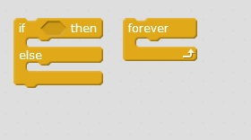
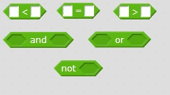
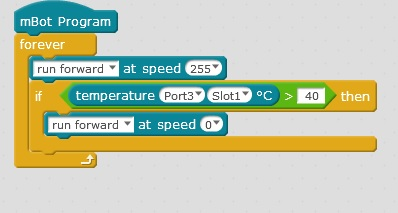

---
layout: default
title: Light Sensors
course: workshop

slides:

  - class: title-slide

    content: |

      

      # Using Sensors
      

    notes: |

      In this chapter you're going to learn how to use light sensors so your robot doesnt go into a dark room.

      By the end of the workshop you will have programmed your robot to use a light sensor. 

    
##########

  - content: |

      ## Loop Control
      {: height="250" width="400"}
      Do you remember if/else/forever loops?
      We will need them for this chapter! 
    notes: |

      Quick recap on if/else/forever statements. Any questions?  

    

##########

  - content: |

      

      ## Operators
      {: height="300" width="450"}
      Do you remember operators?
      They are used to perform comparisons. Eg: 4 < 5

    notes: |
      Give them other examples how operators can be used.

    

##########

  - content: |

      ## Reading Temperature 

      {: height="250" width="400"}
      What will happen in this program?
      You will use a similar statement to this in the next challenge. 
    notes: |

      Explain how operators are used in if/else statements, and how you can compare numbers to number 
      returned by different functions. Explain how you would program the temperature sensor. If you've used a temperature
      sensor in your if statement, your program will go and check what the sensor is equal to, eg 20.
      the temperature variable will be equal to 20, therefore you can compare this number to the other operator and make a decision.

    

##########

  - content: |

      ## Challenge 

      Program the robot to use a light sensor.
      If it drives into a room and it is dark, reverse out of the room.
      If room is light keep driving forwards. 
    notes: |

      0 darkest, 999 lightest
      You may use notes from previous slides.

    

##########

  - content: |

      {: height="200"}

      ## Using Sensors: Completed
      Now lets move on to the next chapter.
      [Take me to the next chapter!](remote.html)

    notes: |

      :)

---