---
layout: default
title: Accelerator
slides:

  - title: title-page
    class: title-slide

    notes: |

      :)

    content: |

      

      # Accelerator
      _Control motor speed via a touchpad_


##########


  - title: overview

    notes: |
      Change the colour of a light by turning a dial.

    content: |

      ## What We Are Making

      A motor which will spin based on 
      a speed reading from a soft touch pad.


##########


  - title: hardware

    notes: |

      Motor, Transistor, Diode, 330&#937; Resistor

      Soft Potentiometer, 10k Resistor, Wires

    content: |

      ## Bits We Need

      - 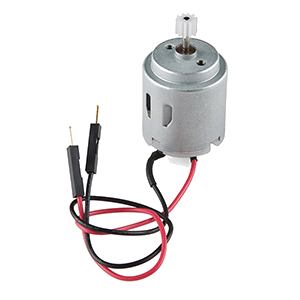{: height="200"}
        **Motor**
        The visual output for our circuit
      - 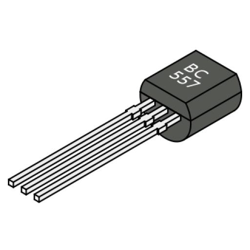{: height="200"}
        **Transistor**
        To amplify the current to the motor
      - 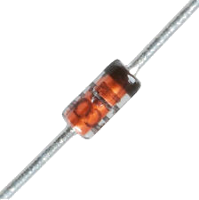{: height="200"}
        **Diode**
        A one-way valve for the current
      - 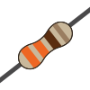{: height="200"}
        **330&#937; Resistor**
      {:.flex-list}

      - 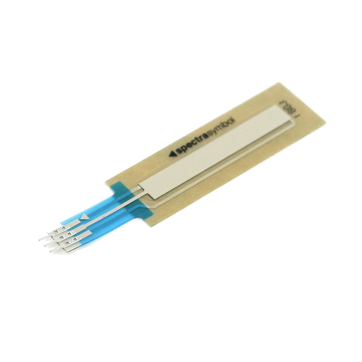{: height="200"}
        **Soft Potentiometer**
      - {: height="200"}
        **10k Resistor**
      - {: height="200"}
        **Wires**
        To connect everything together!
      {:.flex-list}


###########


  - title: motor-overview

    notes: |

      :)

    content: |

      ## Motor Overview

      Setting up our motor will once again consist of two parts:
      the physical components, and the logical components


###########


  - title: motor-info-sheet
    class: info-sheet-slide

    notes: |

      :)

    content: |

      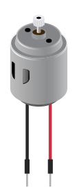{: height="550"}

      ## Motor

      The motor's speed is determined by the voltage you put through it.

      We send the motor an **analog signal** which is a number between 0 and 255.

      The motor needs to be plugged into a digital pin which supports **Pulse Width Modulation** (PWM)

      PWM allows us to send analog signals via a digital pin.


###########


  - title: transistor-info-sheet
    class: info-sheet-slide

    notes: |

      :)

    content: |

      {: height="450"}

      ## Transistor


###########


  - title: diode-info-sheet
    class: info-sheet-slide

    notes: |

      :)

    content: |

      {: height="450"}

      ## Diode    


###########


  - title: motor-physical-components

    notes: |

      Set up your LED as in the diagram.

    content: |

      ## Physical Components <br>of the Motor Circuit

      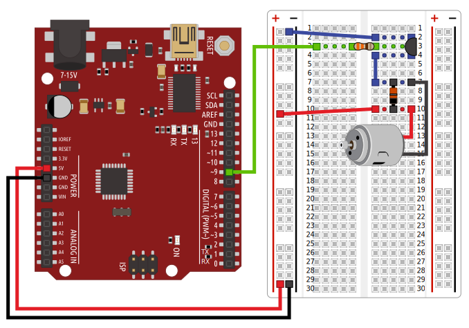{: height="550"}

      Set up your motor as in the diagram.


##########


  - title: motor-logical-components

    notes: |

      Check that your LED works by turning it on.

    content: |

      ## Logical Components <br>of the Motor Circuit

      - {: height="200"}
        **Test Buttons**
        One for "off" and one for "on".
      - {: height="200"}
        **Arduino Output**
        Send the analog value to the motor.
      {:.flex-list}


##########


  - title: motor-out-node

    notes: |

      Drag an `arduino out` node into your workspace and configure it.

      This will pass a message to the configured pin, but will not run automatically. We need to trigger it.

    content: |

      ## Pass a Message Out to the Arduino

      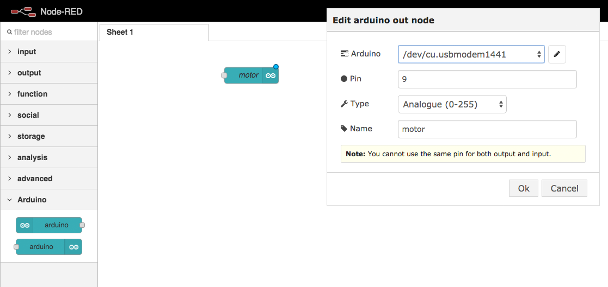{: height="450"}

      Drag an `arduino out` node into your workspace and configure it.


##########


  - title: motor-inject-on-node

    notes: |

      Drag an `inject` node into your workspace and configure it.

    content: |

      ## Inject a Message

      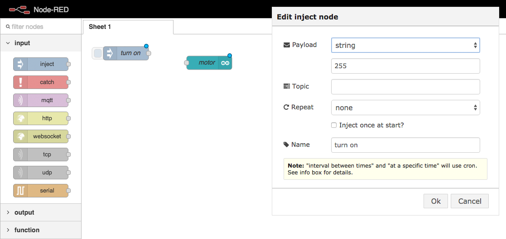{: height="450"}

      Drag an `inject` node into your workspace and configure it.


##########


  - title: motor-inject-off-node

    notes: |

      Drag an `inject` node into your workspace and configure it.

    content: |

      ## Inject a Message

      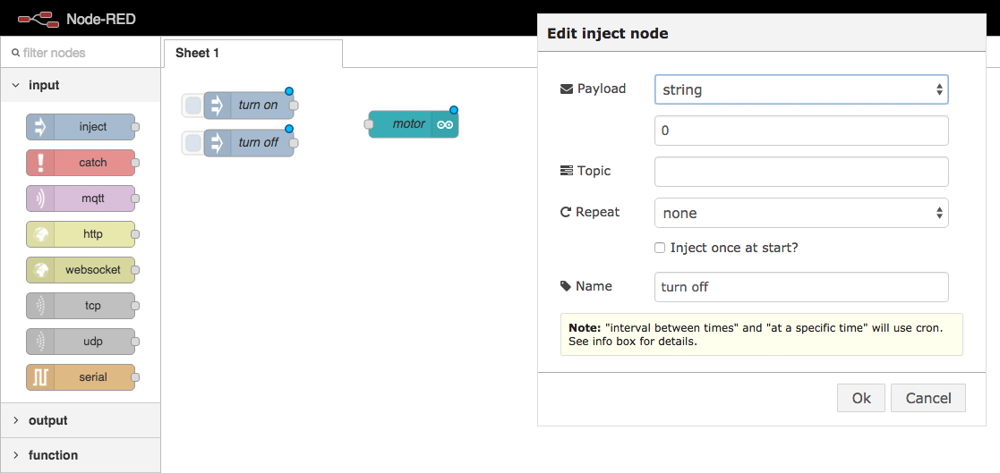{: height="450"}

      Drag an `inject` node into your workspace and configure it.


##########


  - title: motor-join-nodes

    notes: |

      Connect the two nodes.

    content: |

      ## Connect the nodes

      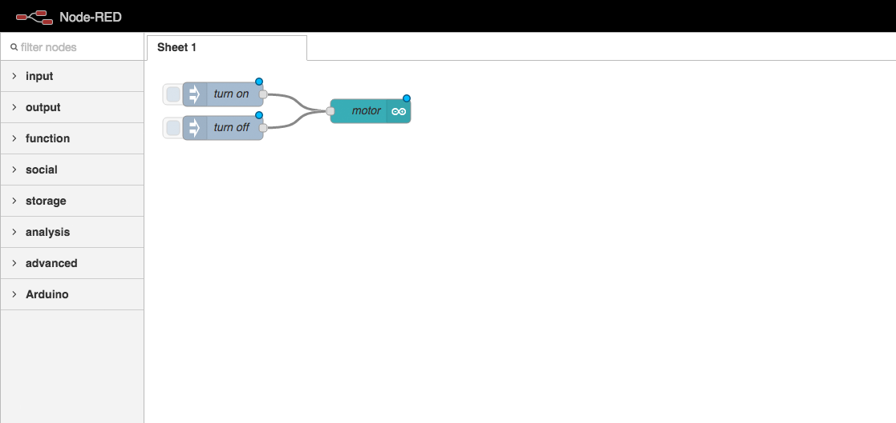{: height="450"}

      Click and drag the small square on the `inject` node,
      and attach it to the `arduino out` node.


##########


  - title: motor-deploy

    notes: |

      :)

    content: |

      ## Deploy Your Code

      

      Click the "Deploy" button in Node Red
      to link your logic flow with the Arduino.


##########


  - title: motor-test

    notes: |

      Check that your LED works by turning it on.

    content: |

      ## Test the Motor Output

      The on-screen buttons should turn the motor on and off.
      {: .checkpoint}


###########


  - title: potentiometer-overview

    notes: |

      :)

    content: |

      ## Potentiometer Overview

      Setting up our potentiometer will also consist of two parts:
      the physical components, and the logical components


##########


  - title: potentiometer-physical-components

    notes: |

      Set up your potentiometer as in the diagram.

    content: |

      ## Physical Components <br>of the Potentiometer Circuit

      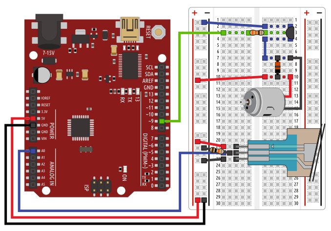{: height="550"}

      Set up your potentiometer as in the diagram.


##########


  - title: potentiometer-logical-components

    notes: |

      :)

    content: |

      ## Logical Components <br>of the Potentiometer Circuit

      - {: height="200"}
        **Potentiometer Input**
        Converts the Arduino signal
        into a JavaScript message.
      - {: height="200"}
        **Debug Logger**
        Displays the JS message on
        the screen when received.
      {:.flex-list}


##########


  - title: potentiometer-arduino-node

    notes: |

      Drag an `arduino out` node into your workspace and configure it.

      This will pass a message to the configured pin, but will not run automatically. We need to trigger it.

    content: |

      ## Receive a Message from the Arduino

      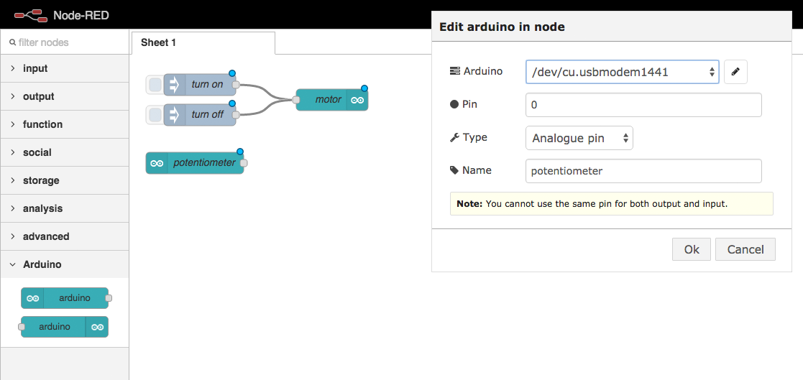{: height="450"}

      Drag an `arduino in` node into your workspace and configure it.


##########


  - title: potentiometer-debug-node

    notes: |

      Drag a `debug` node into your workspace and configure it.

    content: |

      ## Debug the Incoming Data

      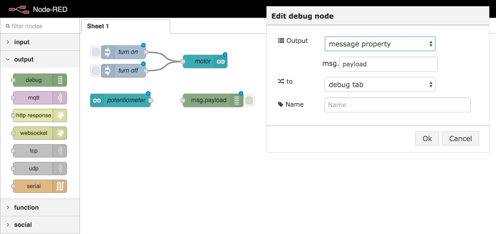{: height="450"}

      Drag a `debug` node into your workspace. The default configuration is fine.


##########


  - title: potentiometer-join-nodes

    notes: |

      Connect the two nodes.

    content: |

      ## Connect the nodes

      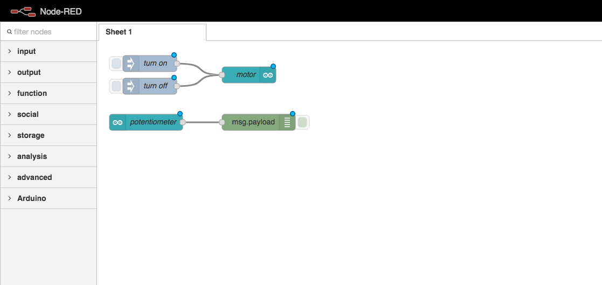{: height="450"}

      Join your `arduino` node to your `debug` node.


##########


  - title: potentiometer-code-deploy

    notes: |

      :)

    content: |

      ## Deploy Your Code

      

      Click the "Deploy" button in Node Red
      to link your logic flow with the Arduino.


##########


  - title: potentiometer-test

    notes: |

      :)

    content: |

      ## Test the potentiometer input

      Turn the dial on your potentiometer.

      You should see value being logged in your debug panel.
      {: .checkpoint}


##########


  - title: circuit-logical-components

    notes: |

      :)

    content: |

      ## Logical Components <br>of the whole circuit

      - 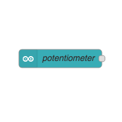{: height="200"}
        **Potentiometer Input**
        Receives an Arduino signal
        as a JavaScript message.
      - 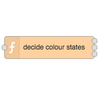{: height="200"}
        **Conversion Function**
        Converts the potentiometer signal into the correct message for the LED.
      - 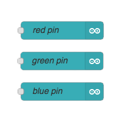{: height="200"}
        **LED Outputs**
        Sends the JavaScript message
        as an Arduino signal.
      {:.flex-list}


##########


  - title: circuit-arduino-nodes

    notes: |

      :)

    content: |

      ## Circuit Arduino Nodes

      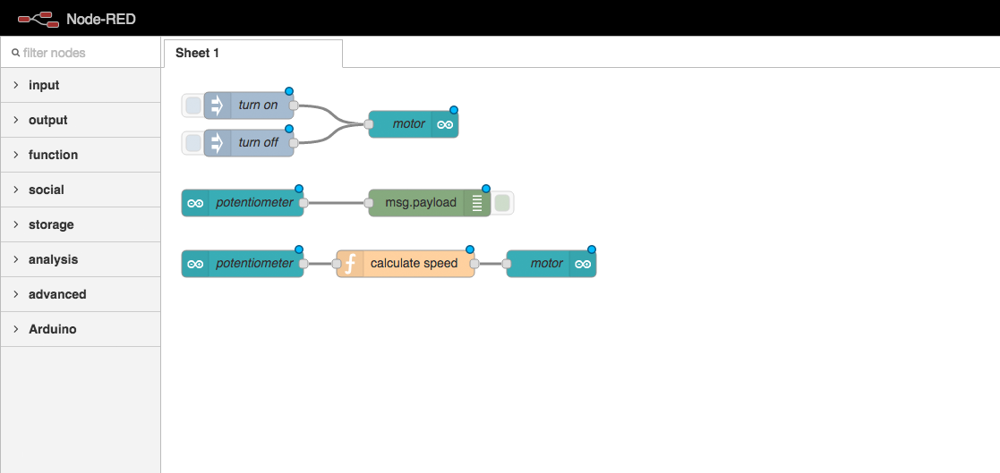

      Link your `arduino input` to the three `arduino output` nodes
      via a `function`, like we did last time.

      This time your function requires three outputs instead of one.


##########


  - title: circuit-function-code

    notes: |

      We don't need to store the state this time.

    content: |

      ## Function Code

      ```javascript
      var pressurePoint = msg.payload;
      var lowestSpeed = 130;
      var highestSpeed = 255;
      var maxPoint = 1024;

      if(pressurePoint < 100) {
          msg.payload = 0;
      } else {
        var percentTotalSpeed = pressurePoint / maxPoint;
        var speedRange = highestSpeed - lowestSpeed;
        var speedAboveMin = percentTotalSpeed * speedRange;
        var finalSpeed = lowestSpeed + speedAboveMin;

        msg.payload = finalSpeed;
      }

      return msg;
      ```

      Paste this code into your `function` config popup,
      in the code editor section.


##########


  - title: circuit-function-code-shorter

    notes: |

      We don't need to store the state this time.

    content: |

      ## Shorter Function Code

      ```javascript
      // mapping function
      getSpeed = function(currentPressure) {
        var pressureMax = 1024;
        var motorMin = 130;
        var motorMax = 255;
        var speed = currentPressure * (motorMax - motorMin) / pressureMax + motorMin;

        return speed;
      }

      msg.payload = (msg.payload > 100) ? getSpeed(msg.payload) : 0;

      return msg;

      ```
      **For experienced coders:**
      This code does exactly the same thing,
      but is a bit shorter.


##########

  - title: circuit-deploy

    notes: |

      :)

    content: |

      ## Deploy Your Code

      

      Click the "Deploy" button in Node Red
      to link your logic flow with the Arduino.


##########

  - title: circuit-test

    notes: |

      :)

    content: |

      ## Full Circuit Test

      Press different points on the soft potentiometer.

      Your motor should spin at different speeds.
      {:.checkpoint}


##########


  - title: summary
    class: centered-slide

    notes: |

      Cool, now let's try something a little more complex...

    content: |

      {:height="200"}

      ## Accelerator: Complete!

      Well done :) That's everything!

---