---
layout: default
title: Binary Blink
slides:

  - title: title-page
    class: title-slide

    notes: |

      Welcome to Electronics with Arduino!

      This taster is designed to introduce you to the basics of sensor input and real-world output using Arduino.

      By the end of the workshop you will have built and coded a selection of small electronics demo projects.

    content: |

      

      # Binary Blink
      _Light on, light off._


##########


  - title: overview

    notes: |
      Turn a light on and off by pushing a button.

    content: |

      

      ## What We Are Making

      Turn a light on and off by pushing a button.


##########


  - title: hardware

    notes: |

      LED, Button, Wires

    content: |

      ## Bits We Need

      - {: height="100"}
        **LED**
        A visual output for our circuit
      - {: height="100"}
        **Button**
        An input, used to turn our light on and off
      - {: height="100"}
        **10k Resistor**
        To regulate the voltage readings from the button
      - {: height="100"}
        **Wires**
        To connect everything together!
      {:.flex-list}


###########


  - title: led-overview

    notes: |

      :)

    content: |

      ## LED Overview

      Setting up our LED will consist of two parts:
      the physical components, and the logical components


###########


  - title: led-physical-components

    notes: |

      Set up your LED as in the diagram.

    content: |

      ## Physical Components <br>of the LED Circuit

      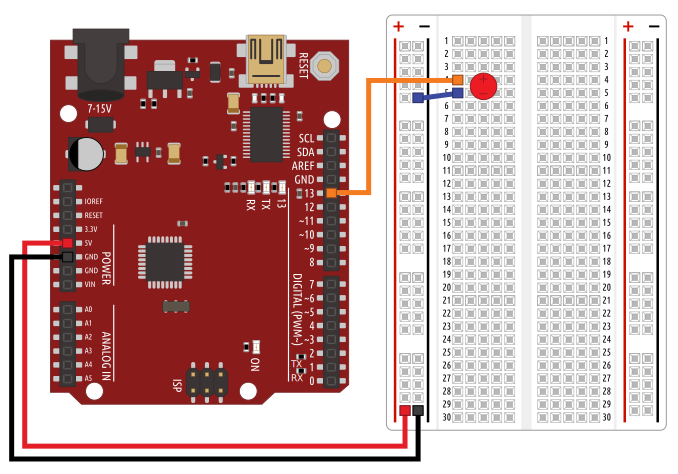{: height="550"}

      Set up your LED as in the diagram.


##########


  - title: led-logical-components

    notes: |

      Check that your LED works by turning it on.

    content: |

      ## Logical Components <br>of the LED Circuit

      - 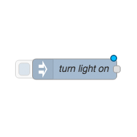{: height="200"}
        **Test Button**
        On-screen button, sends message
        that light should turn on.
      - 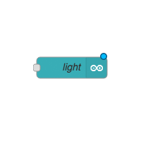{: height="200"}
        **Light Output**
        Converts test button message
        into an Arduino signal.
      {:.flex-list}


##########


  - title: led-out-node

    notes: |

      Drag an `arduino out` node into your workspace and configure it.

      This will pass a message to the configured pin, but will not run automatically. We need to trigger it.

    content: |

      ## Pass a Message Out to the Arduino

      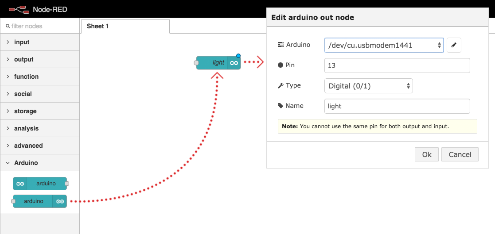{: height="450"}

      Drag an `arduino out` node into your workspace and configure it.


##########


  - title: led-inject-node

    notes: |

      Drag an `inject` node into your workspace and configure it.

    content: |

      ## Inject a Message

      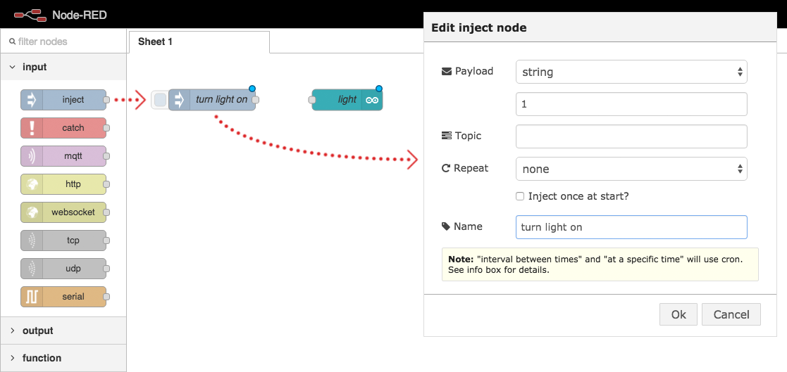{: height="450"}

      Drag an `inject` node into your workspace and configure it.


##########


  - title: led-join-nodes

    notes: |

      Connect the two nodes.

    content: |

      ## Connect the nodes

      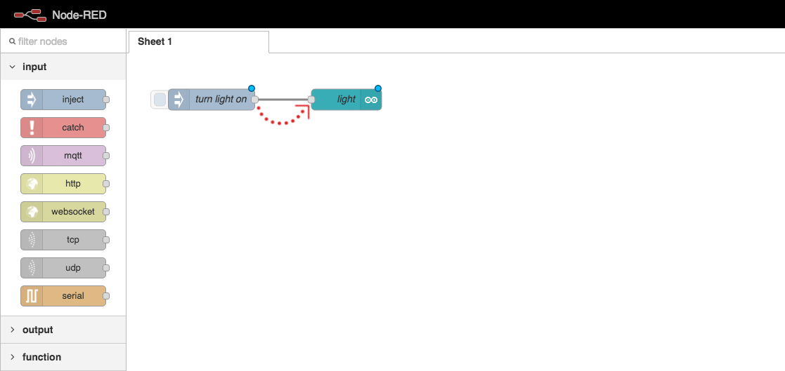{: height="450"}

      Click and drag the small square on the `inject` node,
      and attach it to the `arduino out` node.


##########


  - title: led-deploy

    notes: |

      Drag an `inject` node into your workspace and configure it.

    content: |

      ## Deploy Your Code

      

      Click the "Deploy" button in Node Red
      to link your logic flow with the Arduino.


##########


  - title: output-test

    notes: |

      Check that your LED works by turning it on.

    content: |

      ## Test the LED Output

      Click the square trigger button on the `inject` node.

      Your LED should turn on and stay on.
      {: .checkpoint}


###########


  - title: button-overview

    notes: |

      :)

    content: |

      ## Button Overview

      Setting up our button will also consist of two parts:
      the physical components, and the logical components


##########


  - title: button-physical-components

    notes: |

      Set up your button as in the diagram.

    content: |

      ## Physical Components <br>of the Button Circuit

      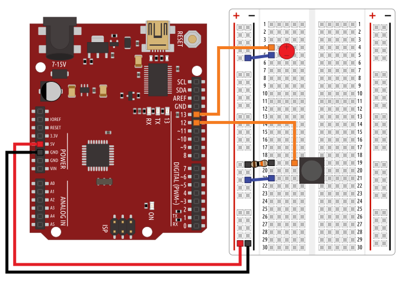{: height="550"}

      Set up your button as in the diagram.


##########


  - title: button-logical-components

    notes: |

      :)

    content: |

      ## Logical Components <br>of the Button Circuit

      - 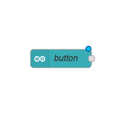{: height="200"}
        **Button Input**
        Converts the Arduino signal
        into a JavaScript message.
      - 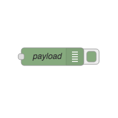{: height="200"}
        **Debug Logger**
        Displays the JS message on
        the screen when received.
      {:.flex-list}


##########


  - title: button-arduino-node

    notes: |

      Drag an `arduino out` node into your workspace and configure it.

      This will pass a message to the configured pin, but will not run automatically. We need to trigger it.

    content: |

      ## Receive a Message from the Arduino

      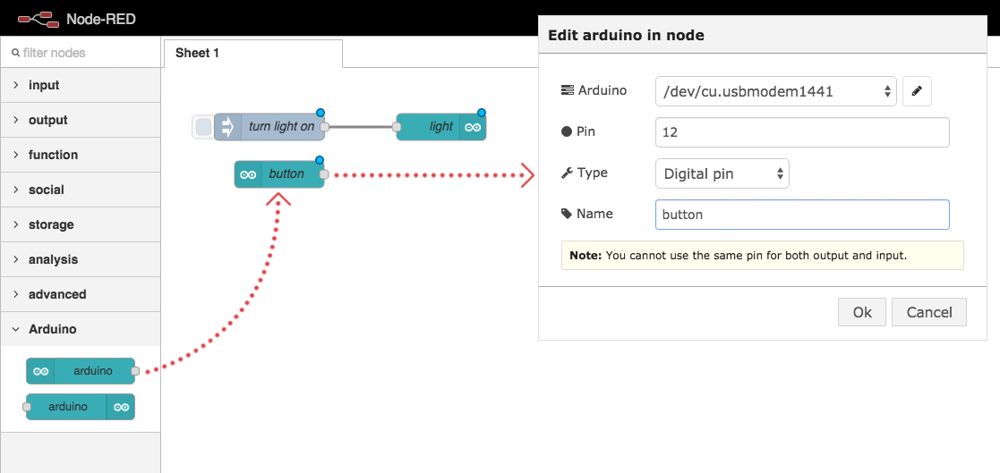{: height="450"}

      Drag an `arduino in` node into your workspace and configure it.


##########


  - title: button-debug-node

    notes: |

      Drag a `debug` node into your workspace and configure it.

    content: |

      ## Debug the Incoming Data

      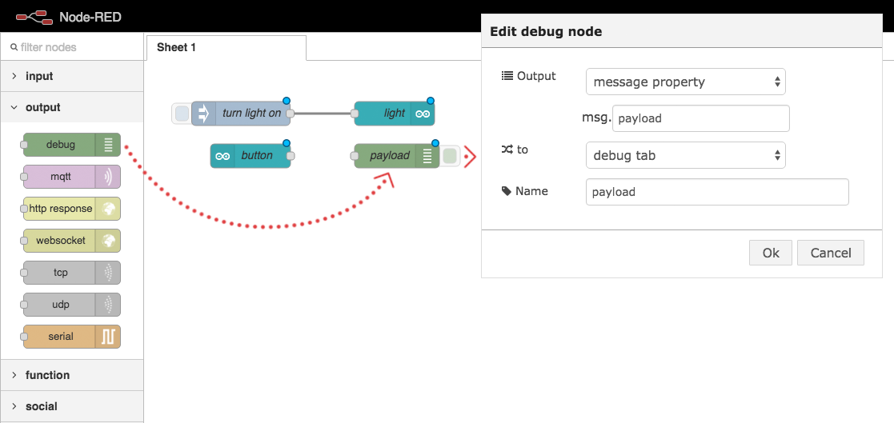{: height="450"}

      Drag a `debug` node into your workspace and configure it.


##########


  - title: button-join-nodes

    notes: |

      Connect the two nodes.

    content: |

      ## Connect the nodes

      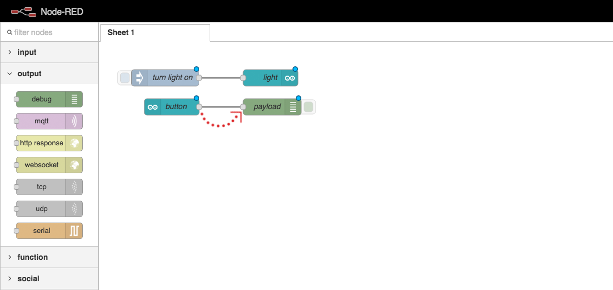{: height="450"}

      Click and drag the small square on the `arduino` node,
      and attach it to the `debug` node.


##########


  - title: button-code-deploy

    notes: |

      :)

    content: |

      ## Deploy Your Code

      

      Click the "Deploy" button in Node Red
      to link your logic flow with the Arduino.


##########


  - title: button-test

    notes: |

      Check that your LED works by turning it on.

    content: |

      ## Test the Button Input

      Press your button down and up again.

      You should see the debug message in your browser.
      {: .checkpoint}


##########


  - title: circuit-logical-components

    notes: |

      :)

    content: |

      ## Logical Components <br>of the whole circuit

      - {: height="200"}
        **Button Input**
        Receives an Arduino signal
        as a JavaScript message.
      - 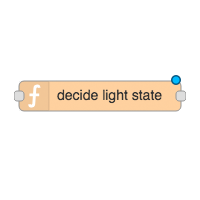{: height="200"}
        **Conversion Function**
        Converts the button signal
        into the correct message
        for the LED.
      - {: height="200"}
        **LED Output**
        Sends the JavaScript message
        as an Arduino signal.
      {:.flex-list}


##########


  - title: circuit-arduino-nodes

    notes: |

      :)

    content: |

      ## Circuit Arduino Nodes

      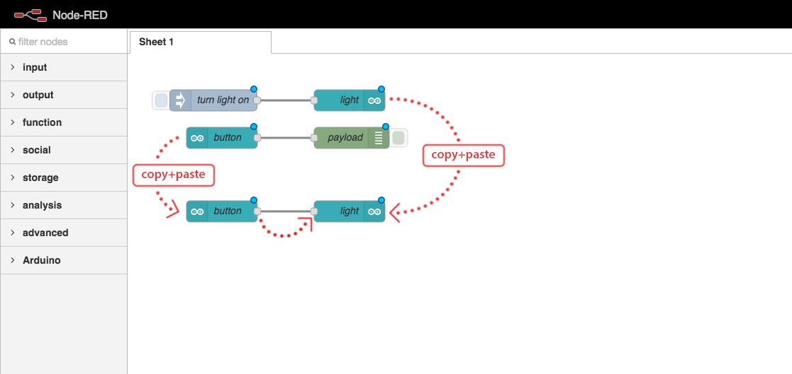

      Link the Arduino input and output directly.

      The LED should be on when the button is pressed down.
      {:.checkpoint}


##########


  - title: circuit-function-node

    notes: |

      Use a function to convert the button's voltage reading to an on/off message for the LED.

    content: |

      ## Conversion Function

      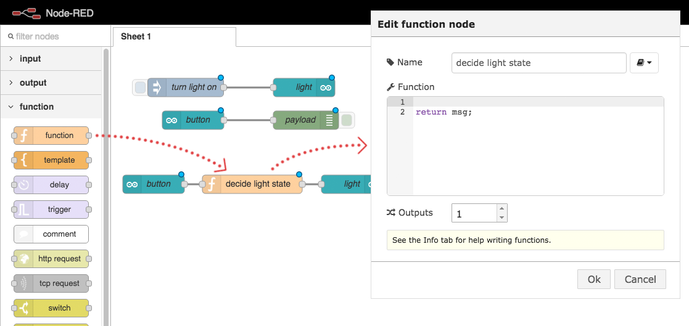

      Link a function between the `in` node and the `out` node,
      so we can manipulate the value being passed along.


##########


  - title: circuit-function-code

    notes: |

      We can use the `context` object to store data between function calls.
      This allows us to toggle on/off with the button.

    content: |

      ## Function Code

      ```javascript
      var buttonPressed = msg.payload;
      var lightOn = context.lightOn;

      if(lightOn === undefined) {
          lightOn = false;
      }
      
      if(buttonPressed === true) {
          if(lightOn === true) {
            lightOn = false;
          } else {
            lightOn = true;
          }
      }

      context.lightOn = lightOn;
      msg.payload = lightOn;

      return msg;
      ```

      Paste this code into your `function` config popup,
      in the code editor section.


##########


  - title: circuit-function-code-shorter

    notes: |

      We can use the `context` object to store the state.
      This allows us to toggle on/off with the button.

    content: |

      ## Shorter Function Code

      ```javascript
      var buttonPressed = msg.payload;
      var lightOn = context.lightOn || false;
      
      if(buttonPressed) {
          lightOn = !lightOn;
      }

      context.lightOn = lightOn;
      msg.payload = lightOn;

      return msg;
      ```
      **For experienced coders:**
      This code does exactly the same thing,
      but is a bit shorter.


##########

  - title: circuit-deploy

    notes: |

      :)

    content: |

      ## Deploy Your Code

      

      Click the "Deploy" button in Node Red
      to link your logic flow with the Arduino.


##########

  - title: circuit-test

    notes: |

      :)

    content: |

      ## Test your circuit

      Your button should now act like an on/off switch

      {:.checkpoint}


##########


  - title: challenge

    notes: |

      Add another LED to your circuit to make a stop/go light.

    content: |

      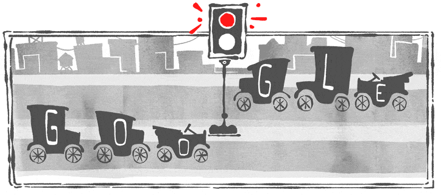

      ## Challenge: Stop and Go

      Add a green LED to your circuit to make a stop/go light.


##########


  - title: summary
    class: centered-slide

    notes: |

      Cool, now let's try something a little more complex...

    content: |

      {:height="200"}

      ## Binary Blink: Complete!

      Cool, now let's try something a little more complex...

      [Take me to the next chapter!](spectrum)

---