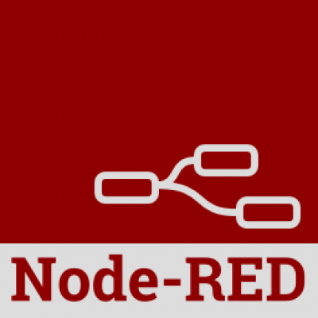
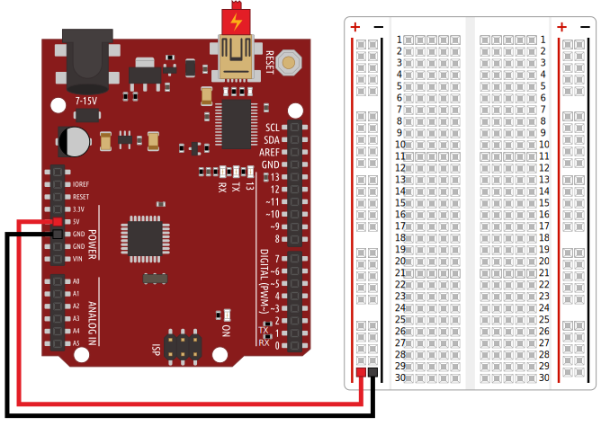

---
layout: default
title: Introduction
slides:

  - title: title-page
    class: title-slide

    notes: |

      Welcome to Electronics with Arduino!

      This taster is designed to introduce you to the basics of sensor input and real-world output using Arduino.

      By the end of the workshop you will have built and coded a selection of small electronics demo projects.

    content: |

      

      # Arduino Taster
      _Electronics with Arduino_

##########

  - title: mentors

    notes: |

      Your mentors are super friendly, make sure to say hi.

      They actually get paid to do this stuff for a job, which is super cool.

      You can ask them for help with your code, ask them about their day job, or ask them what their favourite colour is.

      They're here to help, so ask them anything :)

    content: |

      ## Say hi to your mentors!

      Your mentors are here to help if you get stuck,
      and you can ask them (almost) anything!

##########

  - title: introductions

    notes: |
      Let's quickly go around the room and introduce ourselves.

      Tell us all one of your favourite things - favourite food, sport, hobby, animal, anything!

      If you could choose one super power, which would it be?

      Last of all, tell us your name.

    content: |

      ## Introductions

      What is your:

      - Favourite thing?
      - Super power?
      - First name?
      {:.flex-list}

##########

  - title: schedule

    notes: |
      Today's workshop is arranged in six different sections.

      In the first part we will look at how the Internet works and what this means for us as coders, plus take a look at the basics of web code languages.

      After that we will start working on our own websites, so think about a topic! We will design a page layout and a menu bar.

      Later we will add some fancy extras to our site, like YouTube videos and a gallery.

    content: |

      ## Schedule
       

      **Blinking Lights**
      **On/Off Buttons**

      **Multicolour Lights**
      **Turning Dials**

      **Rotating Objects**
      **Flex Sensors**

##########

  - title: arduinokit

    notes: |

      We are using the Sparkfun Inventor's Kit v3.2

    content: |

      ## SparkFun Inventor's Kit

      {: height="450"}

      We are using the Sparkfun Inventor's Kit v3.2

##########

  - title: arduinoapp

    notes: |

      We need the Arduino App to set up our board.

    content: |

      ## Arduino App

      {: height="350"}

      We need the Arduino App to set up our board.

##########

  - title: nodered

    notes: |

      We are using Node Red as a visual alternative to coding Arduino by hand.

    content: |

      ## Node Red

      {: height="350"}

      We are using Node Red as a visual code editor.

##########

  - title: arduinokitsetup

    notes: |

      Plug your RedBoard into your computer and link up the breadboard.

    content: |

      ## Setting Up Your Arduino

      {: height="450"}

      Plug your Arduino into your computer and link up the breadboard.

      The board's green "ON" light should be on. 
      {:.checkpoint}

##########

  - title: standardfirmatasetup

    notes: |

      Open the Arduino app and use it to upload Standard Firmata

    content: |

      ## Setting Up Standard Firmata

      Open the Arduino app and use it to upload Standard Firmata

##########

  - title: noderedsetup

    notes: |

      Open Node Red and create a blank sheet

    content: |

      ## Start Up the Node Red Server

      Open Node Red and create a blank sheet

##########

  - title: summary
    class: centered-slide

    notes: |

      Great! Now that's all sorted, let's get started!

    content: |

      {: height="200"}

      ## Intro Stuff: Complete!

      Great, now it's time for the fun stuff...

      [Take me to the next chapter!](binary)

---